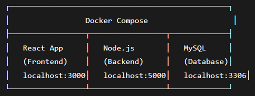

# integration-module

Задачи ДЭ


> Задача №1

# Подсистема работы с партнерами компании

## Описание проекта

Компания занимается производством и реализует свою продукцию через партнеров, которые доставляют продукцию компании до конечных потребителей. Для эффективного взаимодействия с партнерами и контроля их работы требуется система, позволяющая обрабатывать всю информацию в цифровом формате.

## Функционал подсистемы

- Просмотр списка партнеров
- Добавление/редактирование данных о партнере
- Просмотр истории реализации продукции партнером

## Технические требования

### База данных

- Реализация в выбранной СУБД
- Соответствие 3 нормальной форме
- Обеспечение ссылочной целостности
- Согласованная схема именования
- Создание первичных и внешних ключей

### Сущности системы

На данном этапе достаточно создать таблицы, поля с подходящими типами данных и связи, непосредственно относящиеся к разрабатываемой подсистеме.

## Выходные артефакты

### ER-диаграмма

- Формат: PDF
- Содержание: таблицы, связи между ними, атрибуты и ключи
- Примечание: типами данных можно пренебречь

### Импорт данных

- Подготовка данных из файлов заказчика (с пометкой import)
- Загрузка данных в разработанную базу данных

### Скрипт базы данных

- Создание скрипта БД
- Сохранение полученных результатов

## Приложения

**Приложение 1**: Описание предметной области

# Установка MySQL

## Скачивание MySQL Community Server

1. Откройте сайт: [https://dev.mysql.com/downloads/mysql/](https://dev.mysql.com/downloads/mysql/)

2. В разделе "MySQL Community (GPL) Downloads" нажмите "MySQL Community Server"

3. Выберите параметры скачивания:

   - **Operating System**: Microsoft Windows
   - **Version**: MySQL Installer (самый первый в списке)

4. Скачайте файл: `mysql-installer-community-8.0.xx.x.msi`

# Выбор типа установки MySQL

## Доступные варианты конфигурации:

### Development Computer

- **Назначение**: для разработки
- **Ресурсы**: минимальные требования
- **Рекомендации**: для локальной разработки и тестирования

### Server Computer

- **Назначение**: для сервера
- **Ресурсы**: средние требования
- **Рекомендации**: для рабочих серверов с умеренной нагрузкой

### Dedicated Computer

- **Назначение**: выделенный сервер
- **Ресурсы**: максимальные требования
- **Рекомендации**: для высоконагруженных продакшен-серверов

### Создаём пароль (запоминаем его!)

- Нажмите Execute

# Установка MySQL Workbench

## Скачивание MySQL Workbench

1. Перейдите на официальный сайт: [https://dev.mysql.com/downloads/workbench/](https://dev.mysql.com/downloads/workbench/)

## Установка программы

1. Запустите скачанный установочный файл
2. Следуйте инструкциям мастера установки
3. Установите как обычную программу для Windows

# Подключение к MySQL через Workbench

## Запуск MySQL Workbench

1. Запустите MySQL Workbench с рабочего стола или из меню "Пуск"

## Подключение к серверу

1. Нажмите на существующее соединение (обычно называется "Local instance MySQL")

2. Введите пароль root, который вы установили при инсталляции MySQL

# Создание базы данных

## Выполнение SQL-команд в MySQL Workbench

1. **Создаем базу данных**:

```sql
CREATE DATABASE partner_management;
```

```sql
USE partner_management;
```

Как выполнить команды:
Скопируйте команду SQL

Вставьте в окно редактора MySQL Workbench

Нажмите иконку молнии ⚡ (Execute) для выполнения

Повторите для каждой команды по очереди

### Создаем таблицы

В том же окне выполняем команды:

```sql
-- Таблица партнеров
CREATE TABLE partners (
    partner_id INT PRIMARY KEY AUTO_INCREMENT,
    name VARCHAR(255) NOT NULL,
    contact_person VARCHAR(255),
    email VARCHAR(255),
    phone VARCHAR(50),
    address TEXT,
    registration_date DATE,
    status ENUM('active', 'inactive') DEFAULT 'active',
    created_at TIMESTAMP DEFAULT CURRENT_TIMESTAMP
);

-- Таблица продаж
CREATE TABLE product_sales (
    sale_id INT PRIMARY KEY AUTO_INCREMENT,
    partner_id INT NOT NULL,
    product_name VARCHAR(255) NOT NULL,
    quantity INT NOT NULL,
    sale_date DATE NOT NULL,
    amount DECIMAL(10,2) NOT NULL,
    delivery_status ENUM('delivered', 'in_transit', 'pending') DEFAULT 'pending',
    notes TEXT,
    created_at TIMESTAMP DEFAULT CURRENT_TIMESTAMP,
    FOREIGN KEY (partner_id) REFERENCES partners(partner_id) ON DELETE CASCADE
);
```

### Далее:

```sql
USE partner_management;

-- Добавьте эту команду перед DELETE
SET SQL_SAFE_UPDATES = 0;

-- 1. Очистим таблицы (если нужно)
DELETE FROM product_sales;
DELETE FROM partners;
ALTER TABLE partners AUTO_INCREMENT = 1;
ALTER TABLE product_sales AUTO_INCREMENT = 1;

-- 2. Добавляем партнеров
INSERT INTO partners (name, contact_person, email, phone, address, registration_date, status) VALUES
('ООО Ромашка', 'Иванов Иван', 'ivanov@romashka.ru', '+79991234567', 'Москва, ул. Ленина, 1', '2023-01-15', 'active'),
('ИП Сидоров', 'Сидоров Петр', 'sidorov@mail.ru', '+79997654321', 'СПб, Невский пр., 100', '2023-02-20', 'active'),
('ЗАО Весна', 'Петрова Мария', 'petrova@vesna.ru', '+79995554433', 'Екатеринбург, ул. Мира, 25', '2023-03-10', 'active'),
('ООО ТехноПрофи', 'Смирнов Алексей', 'smirnov@technopro.ru', '+79993332211', 'Новосибирск, ул. Советская, 50', '2023-04-05', 'active'),
('ИП Козлова', 'Козлова Анна', 'kozlova@mail.ru', '+79994445566', 'Казань, ул. Баумана, 30', '2023-05-12', 'inactive');

-- 3. Добавляем продажи
INSERT INTO product_sales (partner_id, product_name, quantity, sale_date, amount, delivery_status, notes) VALUES
(1, 'Продукт А', 10, '2024-01-10', 15000.00, 'delivered', 'Регулярная поставка'),
(1, 'Продукт Б', 5, '2024-01-15', 8000.50, 'in_transit', 'Срочный заказ'),
(2, 'Продукт А', 8, '2024-01-12', 12000.00, 'delivered', ''),
(2, 'Продукт В', 15, '2024-01-18', 25000.75, 'pending', 'Крупный заказ'),
(3, 'Продукт Б', 12, '2024-01-20', 18000.00, 'delivered', ''),
(3, 'Продукт А', 20, '2024-01-25', 30000.00, 'delivered', 'Оптовая закупка'),
(4, 'Продукт В', 7, '2024-01-22', 12000.25, 'in_transit', ''),
(5, 'Продукт А', 3, '2024-01-14', 4500.00, 'delivered', 'Пробный заказ');
```

### Проверим данные (убедимся что все загрузилось)

```sql
-- Проверяем партнеров
SELECT * FROM partners;

-- Проверяем продажи
SELECT * FROM product_sales;

-- Проверяем объединенные данные
SELECT p.name, ps.product_name, ps.quantity, ps.sale_date, ps.amount
FROM product_sales ps
JOIN partners p ON ps.partner_id = p.partner_id;
```

# Создание ER-диаграммы

## Генерация диаграммы в MySQL Workbench

### Шаги по созданию:

1. **Запустите Reverse Engineer**:

   - В меню выберите: `Database → Reverse Engineer`

2. **Пройдите шаги мастера**:

   - Нажимайте `Next → Next → Next`

3. **Выберите базу данных**:

   - Выберите базу: `partner_management`

4. **Запустите процесс**:
   - Нажмите кнопку `Execute`

### Экспорт диаграммы:

1. **Сохраните как PDF**:
   - В меню выберите: `File → Export → Export as PDF`

# Резервное копирование базы данных

## Экспорт базы данных в MySQL Workbench

### Шаги по созданию бэкапа:

1. **Запустите Data Export**:

   - В меню выберите: `Server → Data Export`

2. **Выберите базу данных**:

   - Выберите базу: `partner_management`

3. **Настройте параметры экспорта**:

   - Выберите опцию: `Export to Self-Contained File`

4. **Сохраните файл**:
   - Укажите имя файла: `partner_management_backup.sql`

# Тестирование функционала системы

## SQL-запросы для проверки основного функционала

### 1. Просмотр списка партнеров

```sql
SELECT * FROM partners WHERE status = 'active';
```

# Добавление нового партнера

```sql
INSERT INTO partners (name, contact_person, email, phone, address, registration_date, status)
VALUES ('Новый партнер', 'Контакное лицо', 'new@partner.ru', '+79990000000', 'Адрес', '2024-01-30', 'active');
```

# Редактирование данных партнера

```sql
UPDATE partners SET phone = '+79998887766' WHERE partner_id = 1;
```

# Просмотр истории реализации продукции

```sql
SELECT * FROM product_sales WHERE partner_id = 1;
```

# ОСНОВНЫЕ ЗАПРОСЫ ДЛЯ ПОДСИСТЕМЫ

```sql
-- Функционал 1: Просмотр списка партнеров
SELECT partner_id, name, contact_person, email, phone, status
FROM partners
ORDER BY name;

-- Функционал 2: Добавление/редактирование партнера
-- (вы уже тестировали выше)

-- Функционал 3: Просмотр истории реализации
SELECT p.name, ps.product_name, ps.quantity, ps.sale_date, ps.amount, ps.delivery_status
FROM product_sales ps
JOIN partners p ON ps.partner_id = p.partner_id
WHERE p.partner_id = 1  -- для конкретного партнера
ORDER BY ps.sale_date DESC;
```

#### Используйте WHERE в UPDATE и DELETE!

- НЕПРАВИЛЬНО:

```
UPDATE partners SET status = 'inactive'; -- Деактивирует ВСЕХ!
```

ПРАВИЛЬНО:

```
UPDATE partners SET status = 'inactive' WHERE partner_id = 5;
```

## Вопросы, которые очень важны для понимания

- Смогу ли я подключится через браузер к `localhost:3306`?

  - ❌ НЕТ, нельзя подключиться к MySQL через браузер напрямую.

- Можно ли реакт приложение использовать для связи с бд и обработки даннных?

  - Да, абсолютно! React + БД - отличная комбинация

  Архитектура React приложения с БД:
  

⚠️ Важно помнить:

1. React НЕ подключается к БД напрямую - всегда через бэкенд API
2. Настройте CORS для доступа с localhost:3000 (React) к localhost:5000 (бэкенд)
3. Никогда не храните пароли БД в коде фронтенда
4. Используйте environment variables для настроек (env)

   - С помощью docker, я смогу запустить сервер бека, фронта и db?

     - Да, абсолютно правильно! ✅

      

   - Что лучше MySql или Postgress?

     - 📊 Сравнительная таблица:

      

   - Если я захочу другую базу данные создать, не `partner_manager`, возможео ли это?

     - Да, абсолютно! ✅ Можно создавать любые базы данных.

       🎯 Как создать новую базу данных:

       Через `DBeaver` (графический интерфейс)

       Создать → База данных

       Введите имя: например my_new_database

       Нажмите OK

   - 🗑️ Удаление базы данных?

     - DROP DATABASE название базы;

     Осторожно! Удаление безвозвратно!

   - Где хранится бд, ведь, если я захочу перейти на другое устройство, мне не хочется заново всё проделывать?

     - `C:\ProgramData\MySQL\MySQL Server 8.0\Data\`

   - То есть бекап - это вообще всё, что связано с бд, структура и данные, то есть, если я сделаю backup, то смогу на любом устройстве развернуть всё?

     - Да, абсолютно правильно! ✅ 🎯 Backup - это ПОЛНАЯ копия вашей БД

     Чтобы сделайть бекап в `DBeaver`

     Правой кнопкой на базе partner_management

     Инструменты → Дамп базы данных

     Настройки:

     ✅ Включить создание БД

     ✅ Включить структуру таблиц

     ✅ Включить данные

     ✅ Добавить DROP statements

     Сохранить как: backup.sql

     <b>Размер backup</b>:

     Ваша БД: ~5-50 КБ (очень мало)

     Production БД: могут быть гигабайты

     <b>Безопасность</b>:

     Backup файл содержит все данные в открытом виде

     Храните его безопасно (особенно если есть персональные данные)

   - Что значит содержит данные в открытом виде?
     - "Данные в открытом виде" = данные можно прочитать как обычный текст, без расшифровки.

   ⚠️ Риски открытых данных:

   - Потеря флешки (Открывает в блокноте → видит ВСЕ данные партнеров)
   - Отправка по email (Файл проходит через серверы провайдера)
   - Хранение на облаке (Технические специалисты облака имеют доступ)

   <b>🛡️ Как защитить backup:</b>

   1. Архивирование с паролем

      ```
      # Создайте ZIP с паролем
      zip -P ваш_секретный_пароль backup.zip partner_management.sql
      ```

   2. Шифрование файла
      ```
      # Используйте GPG для шифрования
      gpg -c partner_management.sql
      # Будет создан файл: partner_management.sql.gpg
      ```

   - Я так понимаю пароль устанавливается на архив, но к нему же не сложно подобрать пароль?

     - "Не сложно подобрать пароль к архиву?"

       Короткий ответ: Зависит от пароля!

       Детальный разбор:

       Слабые пароли (легко подобрать):

       ```
         ❌ "123456"        - взламывается мгновенно
         ❌ "password"      - несколько секунд
         ❌ "qwerty"        - минуты
         ❌ "ivanov1985"    - часы/дни
       ```

     Сильные пароли (очень сложно подобрать):

     ```
        ✅ "My_Project_Backup_2024!"     - тысячи лет
        ✅ "G7$x9!pL@qR2#vM&"            - миллионы лет
        ✅ "Correct-Horse-Battery-Staple" - миллионы лет (но легко запомнить)
     ```

   - Кто шифрует данные?

     - Шифрование на уровне приложения (Вы)

     ```
        -- ПЕРЕД добавлением в БД
        INSERT INTO users (username, password)
        VALUES ('ivanov', ENCRYPT('my_password'));

        -- Или в коде приложения:
        const encryptedPassword = bcrypt.hash(password, 10);
     ```

     Шифрование на уровне БД (MySQL)

     ```
        -- MySQL встроенное шифрование
        CREATE TABLE users (
           id INT,
           email VARCHAR(255),
           phone VARBINARY(255) -- зашифрованное поле
        );

        -- Шифрование при вставке
        INSERT INTO users VALUES
        (1, 'test@mail.ru', AES_ENCRYPT('+79991234567', 'encryption_key'));
     ```

     Шифрование через `gpg -c partner_management.sql` работает только через `git bash`

     ```
        gpg --symmetric --cipher-algo AES256 --output backup.sql.gpg название бекапа
     ```

     Потребуется установить пароль с подтверждением

     Команда расшифровки в `git bash`

     ```
        gpg --decrypt --output backup_decrypted.sql название зашифрованного файла
     ```

     Если сразу расшифровать или не закрывать консоль `git bash`, то данные расшифруются без запроса пароля. Так как сессия не завершена и в памяти gpg пока он сохранён. Если выйти из консоли, или на другом устройстве потребуется пароль для расшифровки. Пароль нужно помнить, восстановить его будет невозможно!

   - DBeaver можно открыть консоль для работы с базой?

     - Да, вкладка `Редактор SQL` -> открыть скрипт

   - какие поля нужно шифровать?

     -

     1. Критически важные - ШИФРОВАТЬ ОБЯЗАТЕЛЬНО

        ```
           -- Пароли (никогда не храните в открытом виде!)
           -- Паспортные данные
           -- Банковские карты
           -- Медицинские записи
           -- Криптокошельки
        ```

     2. Персональные данные - ШИФРОВАТЬ РЕКОМЕНДУЕТСЯ
        ```
           -- Email адреса
           -- Телефонные номера
           -- Физические адреса
           -- Паспортные данные (серия/номер)
           -- Идентификационные номера
        ```

   - Может ли пользователь посмотреть свой пароль?

     - НЕТ, и это правильно!

     1. Пароли хранятся в виде ХЕШЕЙ, а не шифрования

        ```
           -- НЕПРАВИЛЬНО (шифрование):
           INSERT INTO users VALUES
           (1, 'ivanov', AES_ENCRYPT('password123', 'key'));
           -- Можно расшифровать и увидеть пароль!

           -- ПРАВИЛЬНО (хеширование):
           INSERT INTO users VALUES
           (1, 'ivanov', SHA2('password123', 256));
           -- Невозможно получить исходный пароль!
        ```

     2. Разница между шифрованием и хешированием:
        Шифрование (Encryption):

        ```
           Исходное: "Hello" → Зашифрованное: "G6#fP9@" → Можно расшифровать обратно в "Hello"
        ```

        - Двусторонний процесс

        - Можно восстановить исходные данные

         Как работает аутентификация с хешами:
         ```
            -- 1. Пользователь создает пароль: "mySecret123"
            -- 2. Система создает хеш:
            password_hash = SHA2("mySecret123", 256)
            -- Результат: "a1b2c3d4e5f6..." (64 символа)

            -- 3. Сохраняем в БД:
            INSERT INTO users (username, password_hash) 
            VALUES ('ivanov', 'a1b2c3d4e5f6...');
         ```

         Процесс входа:
         ```
            -- 1. Пользователь вводит: "mySecret123"
            -- 2. Система вычисляет хеш от введенного пароля:
            input_hash = SHA2("mySecret123", 256)

            -- 3. Сравнивает с хешем из БД:
            SELECT * FROM users 
            WHERE username = 'ivanov' 
            AND password_hash = 'a1b2c3d4e5f6...';

            -- Если хеши совпадают - пароль верный!
         ```

      🛡️ Дополнительная защита - "Соль" (Salt):
         Без соли (уязвимо):
         ```
            -- Два пользователя с одинаковым паролем имеют одинаковый хеш
            User1: password="123456" → hash="8d969eef6ecad3c29a3a629280e686cf0c3f5d5a86aff3ca12020c923adc6c92"
            User2: password="123456" → hash="8d969eef6ecad3c29a3a629280e686cf0c3f5d5a86aff3ca12020c923adc6c92"
         ```

         С "солью" (рекомендуется):
         ```
            -- Каждому пользователю своя случайная "соль"
            User1: salt="abc123", password="123456" 
                  → hash=SHA2("abc123123456")

            User2: salt="xyz789", password="123456"
                  → hash=SHA2("xyz789123456") 
            -- Хеши разные даже при одинаковых паролях!
         ```

      Что делать если пользователь забыл пароль:
         ```
            -- 1. Генерируем временный токен сброса
            UPDATE users SET reset_token = 'abc123xyz', token_expires = NOW() + INTERVAL 1 HOUR
            WHERE email = 'user@example.com';

            -- 2. Отправляем ссылку для сброса
            "Перейдите по ссылке чтобы установить новый пароль: 
            https://site.com/reset-password?token=abc123xyz"

            -- 3. Пользователь устанавливает НОВЫЙ пароль
         ```

      - добавление соли не понятно к паролям, если я задам соль разным user, то получается когда человек вводит пароль, то бек должен знать, что добавлять ?
         - Да, абсолютно верно! Backend должен знать соль

            Процесс регистрации:
            ```
               // 1. При регистрации генерируется УНИКАЛЬНАЯ соль для каждого пользователя
               function register(userData) {
                  const salt = generateRandomSalt(); // Уникальная для каждого пользователя
                  const passwordHash = hash(userData.password + salt);
                  
                  // Сохраняем в БД и соль и хеш
                  db.saveUser({
                     username: userData.username,
                     password_hash: passwordHash,
                     salt: salt  // ← Сохраняем соль открыто!
                  });
               }
            ```

            Процесс входа (логина):
            ```
               function login(username, password) {
                  // 1. Достаем пользователя из БД (включая его соль)
                  const user = db.getUser(username);
                  
                  // 2. Берем соль ЭТОГО пользователя и применяем к введенному паролю
                  const inputHash = hash(password + user.salt);
                  
                  // 3. Сравниваем хеши
                  if (inputHash === user.password_hash) {
                     // Пароль верный!
                  }
               }
            ```

            Структура таблицы пользователей:
            ```
               CREATE TABLE users (
                  user_id INT PRIMARY KEY AUTO_INCREMENT,
                  username VARCHAR(100) UNIQUE NOT NULL,
                  password_hash VARCHAR(255) NOT NULL,
                  salt VARCHAR(50) NOT NULL,        -- Соль хранится ОТКРЫТО
                  email VARCHAR(255),
                  created_at TIMESTAMP DEFAULT CURRENT_TIMESTAMP
               );
            ```

            Злоумышленник не может использовать радужные таблицы.
            Ему нужно атаковать КАЖДОГО пользователя отдельно!

## Модуль работы с партнерами

### Описание проекта
Программный модуль для учета партнеров и расчета индивидуальных скидок на основе объема продаж.

### Функциональность
- Вывод списка партнеров из базы данных
- Расчет индивидуальных скидок для партнеров
- Учет продаж продукции за весь период работы

### Алгоритм расчета скидок
Величина скидки рассчитывается на основе общего количества реализованной продукции:
- до 10 000 - 0%
- от 10 000 до 50 000 - 5%
- от 50 000 до 300 000 - 10%
- более 300 000 - 15%

### Технические требования
#### Оформление кода
- **C#/Java**: CamelCase для идентификаторов
- **Python**: snake_case для идентификаторов  
- **1C**: Стандарт именования 1C (https://its.1c.ru/db/v8std#browse:13:-1:31)
- Не более одной команды в строке
- Идентификаторы должны отражать их назначение

#### Интерфейс
- Единый согласованный внешний вид согласно руководству по стилю
- Заголовок окна/страницы соответствует назначению
- Установка иконки приложения (если реализуемо)
- Размещение логотипа компании на главной форме

### Установка и запуск
1. Подключите базу данных к приложению
2. Настройте параметры подключения
3. Запустите приложение

### Тестирование
Модуль прошел отладку и тестирование для проверки:
- Корректной работы всех функций
- Отсутствия аварийного завершения работы
- Правильного расчета скидок
- Корректного отображения данных из БД

## Настройка проекта на `Java` для связи с db (api)
Перед работой надо проверить какой java установлен на компьютере
```cmd
   java -version
   javac -version
```

Ответ
```cmd
# java version "25" 2025-09-16 LTS
# Java(TM) SE Runtime Environment (build 25+37-LTS-3491)
# Java HotSpot(TM) 64-Bit Server VM (build 25+37-LTS-3491, mixed mode, sharing)

# javac 25
```

Для работы нужна `25` версия `java`

---

Скачивание JDK 25

1. Перейдите на официальный сайт:

   - Oracle JDK: https://www.oracle.com/java/technologies/downloads/ (со временем на этой странице появится раздел "Java 25").

   - OpenJDK (рекомендуется): Eclipse Temurin или другие сборки (Azul Zulu, Amazon Corretto). Эти сборки полностью бесплатны для любого использования.

2. Выберите версию и ОС:

3. Найдите раздел JDK 25.

   - Выберите вашу операционную систему (Windows, macOS, Linux) и разрядность (x64, ARM64).

4. Скачайте установщик:

   * Для Windows: обычно файл .msi

   * Для macOS: файл .pkg или архив .tar.gz

   * Для Linux: архив .tar.gz или пакеты (.deb, .rpm)

---

Обязательно! Должна быть переменная окружения на 25, если на другой, то проект не заработает

Проверка статуса переменной окружения
```cmd
echo %JAVA_HOME%
```

Ответ `C:\Program Files\Java\jdk-25`, если версия ниже 25, то проблема с запуском будет.

Установка нужной переменной окружения, если установленно несколько java на компьютере

```cmd
# Установите JAVA_HOME для Java 25
[Environment]::SetEnvironmentVariable("JAVA_HOME", "C:\Program Files\Java\jdk-25", "Machine")

# Перезагрузите переменные среды
$env:JAVA_HOME = "C:\Program Files\Java\jdk-25"

# Проверьте
echo $env:JAVA_HOME
java -version
```

Принудительное обновление, если другие не сработали
```cmd
# Принудительно обновите переменные в текущей сессии
set JAVA_HOME=C:\Program Files\Java\jdk-25
```

Для сборки проекта на java используем сборщик https://start.spring.io/

С настройками:


Пошаговая настройка проекта:
   1. Project → Maven
      - ✅ Выберите Maven (более стандартный для Java проектов)
   2. Language → Java
      - ✅ Выберите Java
   3. Spring Boot → 3.4.10
      - ✅ Выберите 3.4.10 (поддерживает Java 25)
      - ❌ НЕ выбирайте версии 4.x.x - они еще в разработке
      - ❌ НЕ выбирайте SNAPSHOT версии - они нестабильные
   4. Project Metadata - заполните так:
      | Поле         | Значение              | Объяснение                |
      |--------------|-----------------------|---------------------------|
      | Group        | com.company           | Идентификатор вашей компании |
      | Artifact     | partners              | Название проекта          |
      | Name         | partner-system        | Отображаемое имя          |
      | Description  | Partner management system | Описание проекта       |
      | Package name | com.company.partners  | Автоматически заполнится  |
      | Packaging    | Jar                   | Формат упаковки           |
      | Java         | 25                    | Версия Java               |

   5. Dependencies - добавьте следующие зависимости
      * Обязательные зависимости:
         - ✅ Spring Web - для REST API
         - ✅ Spring Data JPA - для работы с базой данных
         - ✅ MySQL Driver - драйвер для MySQL
      * Дополнительные (рекомендуемые):
         - ✅ Spring Boot DevTools - для горячей перезагрузки
         - ✅ Lombok - для сокращения boilerplate кода (опционально)

После генерации проекта:
   1. Структура проекта будет такой:
      ```bash
      partner-system/
      ├── src/
      │   └── main/
      │       ├── java/com/company/partners/
      │       │   └── PartnerSystemApplication.java
      │       └── resources/
      │           └── application.properties
      ├── pom.xml
      └── README.md
      ```

   2. Настройте application.properties:
```
# База данных (замените на ваши настройки)
spring.datasource.url=jdbc:mysql://localhost:3306/partner_system
spring.datasource.username=ваш_username
spring.datasource.password=ваш_пароль

# Для разработки - показывать SQL запросы
spring.jpa.show-sql=true
spring.jpa.properties.hibernate.format_sql=true

# Порт приложения
server.port=8080
```

Внимательно разберите эти настройки!

   3. Запустите проект:
```
# В папке проекта
.\mvnw.cmd spring-boot:run
```

   4. Почему именно такие настройки:
      - Spring Boot 3.4.10 - стабильная версия с поддержкой Java 25
      - Maven - стандартная система сборки для Java
      - Jar - не требует внешнего сервера приложений
      - Java 25 - соответствует вашей установленной версии
      - Зависимости - `минимальный набор` для работы с партнерами и БД

Основные команды:
   - Запуск проекта
```
.\mvnw.cmd spring-boot:run
```
   - Очистка проекта и перезапуск (`Аварийный метод`)
```
.\mvnw.cmd clean compile
.\mvnw.cmd spring-boot:run
```
   - Принудительное обновление зависимостей `Крайний метод`
```
.\mvnw.cmd clean compile -U
.\mvnw.cmd spring-boot:run
```

Проверка работоспособности проекта на java 25
   1. Создайте простой тестовый контроллер для проверки:
      - src/main/java/com/company/partners/controller/TestController.java:
```java
package com.company.partners.controller;

import org.springframework.web.bind.annotation.GetMapping;
import org.springframework.web.bind.annotation.RestController;

@RestController
public class TestController {
    
    @GetMapping("/test")
    public String test() {
        return "Spring Boot is working with Java 25!";
    }
}
```

   2. Запустите проект
```
.\mvnw.cmd spring-boot:run
```

   3. Проверить по адресу: http://localhost:8080/test

   4. Настройте свою базу, под `backend`
      - src/main/resources/application.properties
   
   5. Создайте простую сущность для тестирования под вашу базу (`модель`):
      - src/main/java/com/company/partners/model/Partner.java:
```java
package com.company.partners.model;

import jakarta.persistence.*;

@Entity
@Table(name = "partners")
public class Partner {
    @Id
    @GeneratedValue(strategy = GenerationType.IDENTITY)
    private Long id;
    
    @Column(name = "name", nullable = false)
    private String name;
    
    @Column(name = "email")
    private String email;
    
    @Column(name = "phone")
    private String phone;
    
    @Column(name = "total_sales")
    private Double totalSales = 0.0;
    
    // Конструкторы
    public Partner() {}
    
    public Partner(String name, String email, String phone) {
        this.name = name;
        this.email = email;
        this.phone = phone;
    }
    
    // Геттеры и сеттеры
    public Long getId() { return id; }
    public void setId(Long id) { this.id = id; }
    
    public String getName() { return name; }
    public void setName(String name) { this.name = name; }
    
    public String getEmail() { return email; }
    public void setEmail(String email) { this.email = email; }
    
    public String getPhone() { return phone; }
    public void setPhone(String phone) { this.phone = phone; }
    
    public Double getTotalSales() { return totalSales; }
    public void setTotalSales(Double totalSales) { this.totalSales = totalSales; }
}
```

Внимательно разберите код (обратите внимение на private, public, конструкторы)!

   6. Repository для работы с базой данных:
      - src/main/java/com/company/partners/repository/PartnerRepository.java:
```java
package com.company.partners.repository;

import com.company.partners.model.Partner;
import org.springframework.data.jpa.repository.JpaRepository;
import org.springframework.stereotype.Repository;

@Repository
public interface PartnerRepository extends JpaRepository<Partner, Long> {
    // Дополнительные методы можно добавить здесь
}
```

   7. Service с бизнес-логикой:
      - src/main/java/com/company/partners/service/PartnerService.java:
```java
package com.company.partners.service;

import com.company.partners.model.Partner;
import com.company.partners.repository.PartnerRepository;
import org.springframework.beans.factory.annotation.Autowired;
import org.springframework.stereotype.Service;

import java.util.List;

@Service
public class PartnerService {

    @Autowired
    private PartnerRepository partnerRepository;

    // Получить всех партнеров
    public List<Partner> getAllPartners() {
        return partnerRepository.findAll();
    }

    // Получить партнера по ID
    public Partner getPartnerById(Long id) {
        return partnerRepository.findById(id).orElse(null);
    }

    // Создать нового партнера
    public Partner createPartner(Partner partner) {
        return partnerRepository.save(partner);
    }

    // Обновить партнера
    public Partner updatePartner(Long id, Partner partnerDetails) {
        Partner partner = partnerRepository.findById(id).orElse(null);
        if (partner != null) {
            partner.setName(partnerDetails.getName());
            partner.setEmail(partnerDetails.getEmail());
            partner.setPhone(partnerDetails.getPhone());
            partner.setTotalSales(partnerDetails.getTotalSales());
            return partnerRepository.save(partner);
        }
        return null;
    }

    // Удалить партнера
    public void deletePartner(Long id) {
        partnerRepository.deleteById(id);
    }

    // Рассчитать скидку для партнера
    public Double calculateDiscount(Long partnerId) {
        Partner partner = partnerRepository.findById(partnerId).orElse(null);
        if (partner != null) {
            Double totalSales = partner.getTotalSales();
            if (totalSales > 300000) return 0.15;
            else if (totalSales > 50000) return 0.10;
            else if (totalSales > 10000) return 0.05;
            else return 0.0;
        }
        return 0.0;
    }
}
```

   8. Полный контроллер для работы с партнерами:
      - src/main/java/com/company/partners/controller/PartnerController.java:
```java
package com.company.partners.controller;

import com.company.partners.model.Partner;
import com.company.partners.service.PartnerService;
import org.springframework.beans.factory.annotation.Autowired;
import org.springframework.http.ResponseEntity;
import org.springframework.web.bind.annotation.*;

import java.util.List;

@RestController
@RequestMapping("/api/partners")
public class PartnerController {

    @Autowired
    private PartnerService partnerService;

    // Получить всех партнеров
    @GetMapping
    public List<Partner> getAllPartners() {
        return partnerService.getAllPartners();
    }

    // Получить партнера по ID
    @GetMapping("/{id}")
    public ResponseEntity<Partner> getPartnerById(@PathVariable Long id) {
        Partner partner = partnerService.getPartnerById(id);
        if (partner != null) {
            return ResponseEntity.ok(partner);
        } else {
            return ResponseEntity.notFound().build();
        }
    }

    // Создать нового партнера
    @PostMapping
    public Partner createPartner(@RequestBody Partner partner) {
        return partnerService.createPartner(partner);
    }

    // Обновить партнера
    @PutMapping("/{id}")
    public ResponseEntity<Partner> updatePartner(@PathVariable Long id, @RequestBody Partner partnerDetails) {
        Partner updatedPartner = partnerService.updatePartner(id, partnerDetails);
        if (updatedPartner != null) {
            return ResponseEntity.ok(updatedPartner);
        } else {
            return ResponseEntity.notFound().build();
        }
    }

    // Удалить партнера
    @DeleteMapping("/{id}")
    public ResponseEntity<Void> deletePartner(@PathVariable Long id) {
        Partner partner = partnerService.getPartnerById(id);
        if (partner != null) {
            partnerService.deletePartner(id);
            return ResponseEntity.ok().build();
        } else {
            return ResponseEntity.notFound().build();
        }
    }

    // Рассчитать скидку для партнера
    @GetMapping("/{id}/discount")
    public ResponseEntity<Double> calculateDiscount(@PathVariable Long id) {
        Double discount = partnerService.calculateDiscount(id);
        return ResponseEntity.ok(discount);
    }

    // Тестовые endpoints
    @GetMapping("/test")
    public String test() {
        return "Partner API is working!";
    }

    @GetMapping("/health")
    public String health() {
        return "Partner controller is healthy!";
    }
}
```

   9. Обновите модель Partner (добавьте toString):
      - src/main/java/com/company/partners/model/Partner.java:
```java
package com.company.partners.model;

import jakarta.persistence.*;

@Entity
@Table(name = "partners")
public class Partner {
    @Id
    @GeneratedValue(strategy = GenerationType.IDENTITY)
    @Column(name = "partner_id")  // Измените на partner_id
    private Long id;
    
    @Column(name = "name", nullable = false)
    private String name;
    
    @Column(name = "contact_person")  // Добавьте эту колонку
    private String contactPerson;
    
    @Column(name = "email")
    private String email;
    
    @Column(name = "phone")
    private String phone;
    
    @Column(name = "address")  // Добавьте эту колонку
    private String address;
    
    @Column(name = "total_sales")
    private Double totalSales = 0.0;
    
    // Конструкторы
    public Partner() {}
    
    public Partner(String name, String email, String phone) {
        this.name = name;
        this.email = email;
        this.phone = phone;
    }
    
    // Геттеры и сеттеры
    public Long getId() { return id; }
    public void setId(Long id) { this.id = id; }
    
    public String getName() { return name; }
    public void setName(String name) { this.name = name; }
    
    public String getContactPerson() { return contactPerson; }
    public void setContactPerson(String contactPerson) { this.contactPerson = contactPerson; }
    
    public String getEmail() { return email; }
    public void setEmail(String email) { this.email = email; }
    
    public String getPhone() { return phone; }
    public void setPhone(String phone) { this.phone = phone; }
    
    public String getAddress() { return address; }
    public void setAddress(String address) { this.address = address; }
    
    public Double getTotalSales() { return totalSales; }
    public void setTotalSales(Double totalSales) { this.totalSales = totalSales; }
    
    @Override
    public String toString() {
        return "Partner{" +
                "id=" + id +
                ", name='" + name + '\'' +
                ", contactPerson='" + contactPerson + '\'' +
                ", email='" + email + '\'' +
                ", phone='" + phone + '\'' +
                ", address='" + address + '\'' +
                ", totalSales=" + totalSales +
                '}';
    }
}
```

   10. Тестирование API:
      - GET запросы (через браузер):
         - http://localhost:8080/api/partners - получить всех партнеров

   11. Для тестирования POST/PUT запросов используйте `Postman`

